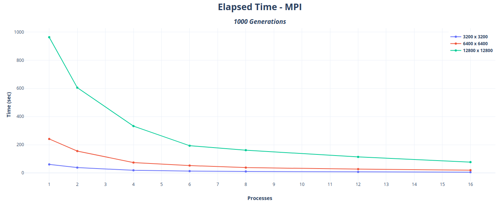
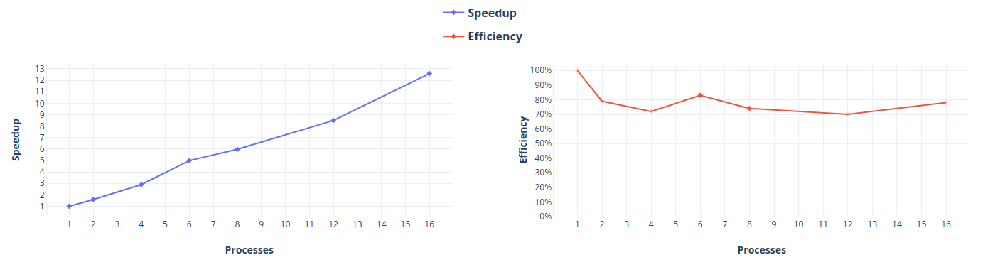

# Game of Life

## About
A parallel implementation of [Conway's Game of Life](https://en.wikipedia.org/wiki/Conway%27s_Game_of_Life "Wikipedia") . MPI is used in order to leverage the processing power of many machines(nodes) working in parallel. In addition, we incorporate OpenMP directives for parallelization of *for loops*, thus creating a hybrid *MPI+OpenMp* implementation of the game.

## Implementation

The main concept behind parallel implementation is splitting the *N x M* board into equally sized blocks. Each process is then assigned a single block to work on. Blocks might slightly differ in size in case an exact division of the board is not possible.

Each process should be able to compute the inner part of the assigned block straight away. However computing the new generation values (0,1) for the 4 sides of the block cannot be done very easily. That is because, the border cells have neighbors residing in another block. Consequently, inter-process communication (i.e: message passing) is required in order for the current process to fetch the values of those neighbors . 

## How to run

* MPI only :

  `make mpi`

  `cd mpi`

  `mpiexec [-n <NoPROCESSES>] [-f <machine_file>] ./gameoflife -n <ROWS> -m <COLUMNS> -max <MAX_GENS> [-f <inputfile>]`

* MPI+OpenMP :

  `make mpi_openmp`

  `cd mpi_openmp`

  `mpiexec [-n <NoPROCESSES>] [-f <machine_file>] ./gameoflife -n <ROWS> -m <COLUMNS> -max <MAX_GENS> -t threads [-f <inputfile>]`

### Notes

* You may create your own *initial generation* using the `make grid` command.

* In case no `inputfile` is given, the grid will be filled randomly.

* [machines](./machines) file contains a list with machine entries of the following format `<machine_name>:<number_of_cores_to_be_used>`

## Benchmarking

Game of Life offers a really high potential for scalability. Measuring the MPI's version execution time for high-dimensional grids, we noticed a very high speedup as well as sufficient efficiency. Our experiments were conducted in a LAN of PCs with identical specs and at most 2 processes per machine (see [machines](./machines)). Each one had the following specs:

* Intel i5-6500 3.2 GHz, 4 cores, 4 threads
* 16GB RAM

